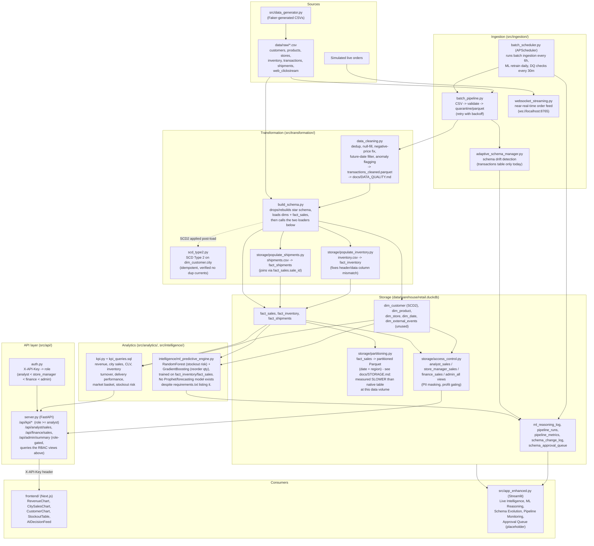

# RetailOS Architecture

End-to-end data flow, from raw source files through to the dashboards and
API consumers. This reflects what the code in this repo actually does, not
an idealized target state - see the inline notes for known gaps.

## Data flow

## Component notes (what's real vs. what's a known gap)

| Layer | Status |
|-------|--------|
| Batch ingestion retry/backoff | Real - `batch_pipeline.py`'s `_read_with_retries` genuinely retries with exponential backoff. |
| Schema evolution detection | Partial - only registered for the `transactions` table; other 6 tables have no schema drift detection. |
| Near-real-time ingestion | Real - `websocket_streaming.py` genuinely streams simulated orders. |
| Data cleaning | Real - dedup, null-fill, negative-price fix, anomaly flagging all genuinely run and produce `docs/DATA_QUALITY.md` as evidence. |
| SCD Type 2 | Real - `scd_type2.py` correctly expires/inserts customer city-change history, with idempotency checks. |
| Star schema build | Real, and now also populates `fact_inventory`/`fact_shipments` (previously left empty). |
| Partitioning | Implemented and does prune correctly, but measured *slower* than a plain DuckDB scan at this data volume - see `docs/STORAGE.md` for real numbers and why. |
| RBAC / PII masking | Real, and now actually enforced at the API layer via `src/api/auth.py` - not just decorative views. Scope boundary: doesn't cover direct access to the `.duckdb` file itself (see `docs/STORAGE.md`). |
| ML stockout/reorder models | Real - trained on actual `fact_inventory`/`fact_sales` data (previously silently fell back to random dummy data because it queried columns that didn't exist). |
| Demand forecasting (Prophet) | **Not implemented.** `prophet` is listed in `requirements.txt` and mentioned in older docs/README text, but never imported anywhere in `src/`. Any "forecast" language elsewhere refers to a simple current-stock/avg-daily-demand runway estimate, not a real time-series model. |
| API auth | Real, demo-scoped (see `src/api/auth.py`'s docstring) - not production-grade credential management. |
| Dashboards | `src/app_enhanced.py` is the canonical Streamlit dashboard (two prior duplicates deleted). Its Schema Evolution and Pipeline Monitoring tabs are fully working; its ML tabs were rewritten to match the real `ml_reasoning_log` schema. `frontend/` (Next.js) is the canonical web dashboard (a stale `retailos-frontend/` duplicate was deleted). |

## Still missing from the original assignment spec
- A polished, non-Mermaid visual diagram (this file satisfies "architecture
  diagram" via a Mermaid flowchart, which GitHub renders inline - no
  separate image tool was used).
- A committed sample of the final analytical tables - see
  `docs/sample_dataset/` (added alongside this file).
